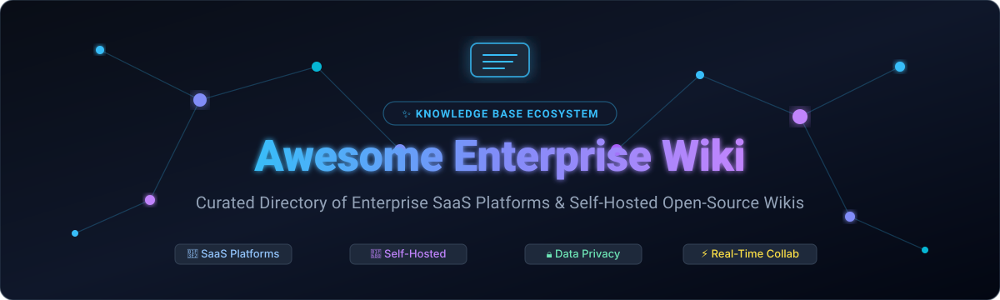

  

# 📚 Awesome Enterprise Wiki 

  
  
  
  
  
  

---

## 🌟 Overview & Enterprise Ecosystem

A comprehensive, curated collection of the top **Enterprise Wiki platforms**, **team knowledge bases**, **internal documentation systems**, and **self-hosted open-source wiki solutions**.

Modern organizations rely on structured knowledge management software to break down silos, streamline engineering onboarding, ensure compliance, and empower asynchronous collaboration. Whether you are evaluating hosted enterprise SaaS solutions (like Confluence or Notion) or deploying self-hosted, privacy-first open-source documentation hubs (like BookStack, Outline, or Wiki.js), this directory provides transparent pricing, scale insights, and star-ranked open-source alternatives.

---

## 📑 Table of Contents

- [🏢 SaaS Platforms](#-saas-platforms)
- [💻 Open-Source GitHub Projects](#-open-source-github-projects)
- [🛠️ Architecture & Custom Wiki Frameworks](#️-architecture--custom-wiki-frameworks)
- [🤝 How to Contribute](#-how-to-contribute)
- [📈 Star History](#-star-history)
- [⚠️ Disclaimer](#️-disclaimer)

---

## 🏢 SaaS Platforms

*Curated table of leading hosted enterprise knowledge bases and company wikis, sorted by company valuation / revenue scale (descending).*

| 🏢 Product | 📝 Description & Core Focus | 💰 Starting Price | 🎁 Free Tier / Trial Limits | 📊 Company Scale (Valuation / Revenue) |
| :--- | :--- | :--- | :--- | :--- |
| **[Confluence (Atlassian)](https://www.atlassian.com/software/confluence)** | Industry-standard enterprise team wiki deeply integrated with Jira, Bitbucket, and the Atlassian product ecosystem for structured documentation. | $6.05 / user / month (Standard plan) | **Free Plan:** Free forever for up to 10 users with 2 GB total storage, unlimited spaces/pages, and standard integrations (excludes granular permissions and audit logs). | ~$48 Billion Market Cap (~$4.4B Annual Revenue) |
| **[Notion](https://www.notion.so/)** | Flexible, all-in-one collaborative workspace that merges structured docs, company wikis, relational databases, and project management. | $10.00 / user / month billed annually ($12.00 billed monthly for Plus) | **Free Plan:** Unlimited blocks for solo users; capped at 1,000 blocks when 2+ team members collaborate. Includes 5 MB file upload limit, 10 guest collaborators, and 7-day page history. | ~$10.0 Billion Valuation (~$300M+ ARR) |
| **[GitBook](https://www.gitbook.com/)** | Developer-friendly knowledge and technical documentation platform with native Git sync, Markdown editor, and public/private publishing. | $65.00 / site / month + $12.00 / user / month (Premium plan, billed annually) | **Free Plan:** Free forever for 1 user on a `gitbook.io` subdomain with unlimited traffic and preview builds; paid team plans offer a 14-day free trial. | ~$350 Million Valuation (~$20M ARR / $47M+ raised) |
| **[Guru](https://www.getguru.com/)** | AI enterprise knowledge platform and verified wiki that delivers contextual answers and cards directly inside Slack, Teams, and browsers. | $15.00 / user / month billed annually ($18.00 billed monthly for All-in-one plan) | **Free Trial:** 30-day free trial with full access to AI enterprise search, browser extension, Slack/Teams integration, and verification workflows (no permanent free plan). | ~$250 Million Valuation (~$18M ARR / $70M+ raised) |
| **[Document360](https://document360.com/)** | Specialized knowledge base and help authoring platform built for internal SOPs, product documentation, API docs, and analytics. | $99.00 / project / month billed annually ($149.00 billed monthly for Professional plan) | **Free Trial:** 14-day free trial with access to 1 project workspace, up to 5 team accounts, full analytics, and 100 API calls/min (no permanent free plan). | ~$120 Million Valuation (~$20M ARR parent Kovai.co) |
| **[Slab](https://slab.com/)** | Clean, fast modern wiki and knowledge hub engineered for simplicity, unified cross-tool search, and friction-free team knowledge sharing. | $6.67 / user / month billed annually ($8.00 billed monthly for Startup) | **Free Plan:** Free forever for up to 10 users with unlimited posts/topics, 10 MB per attachment limit, 90-day version history, and standard integrations (excludes SAML SSO/SCIM). | ~$50 Million Valuation (~$6M ARR / $8.2M raised) |
| **[Slite](https://slite.com/)** | AI-native team knowledge base and wiki that automatically verifies content freshness, summarizes discussions, and syncs team docs. | $10.00 / user / month (Standard plan billed annually) | **Free Trial:** 14-day free trial with full access to AI assistant, verification bot, templates, and team integrations (no permanent free plan). | ~$40 Million Valuation (~$4M ARR / $15M+ raised) |
| **[Nuclino](https://www.nuclino.com/)** | Lightweight, ultra-fast visual workspace combining docs, wikis, mind-map graphs, and Kanban boards with instant collaboration. | $6.00 / user / month billed annually ($8.00 billed monthly for Standard) | **Free Plan:** Free forever for unlimited users capped at 50 items (documents/pages), 3 canvas boards, 2 GB total storage, and 5 MB file upload limit. | ~$20 Million Valuation (~$3M ARR) |
| **[Tettra](https://tettra.com/)** | Knowledge management system purpose-built for Slack/Microsoft Teams teams, featuring question-answering workflows and smart curation. | $4.00 / user / month billed annually ($5.00 billed monthly; 10 user minimum = $40.00 / month for Basic) | **Free Trial:** 30-day free trial with full access to Q&A workflows, Slack integration, and up to 100 users (no permanent free plan). | ~$15 Million Valuation (~$2.5M ARR / $3M raised) |
| **[Outline](https://www.getoutline.com/)** | Polished, markdown-first team wiki and documentation service with real-time multiplayer editing and structured collections (hosted cloud edition). | $10.00 / month flat rate (for 1–10 users; $4.00 / user / month for teams >10) | **Free Trial:** 30-day free trial with full cloud features (unlimited docs and team members); becomes read-only with document export allowed after 30 days unless upgraded. *(Self-hosted edition is 100% free open source).* | ~$8 Million Valuation (~$1.5M ARR) |

---

## 💻 Open-Source GitHub Projects

*Top open-source wiki engines and self-hosted documentation systems, sorted by GitHub star count (descending).*

- **[AppFlowy](https://github.com/AppFlowy-IO/AppFlowy)**   
  Leading open-source Notion alternative built with Flutter and Rust. Empowers teams to manage projects, wikis, and notes with built-in AI while maintaining 100% data sovereignty.

- **[AFFiNE](https://github.com/toeverything/AFFiNE)**   
  Next-generation collaborative workspace that unifies docs, whiteboards, and structured databases into an all-in-one local-first multimodal knowledge base.

- **[Memos](https://github.com/usememos/memos)**   
  Privacy-first, lightweight knowledge base and note-taking service with Markdown, RESTful APIs, multi-user support, and instant self-hosting via Docker.

- **[Joplin](https://github.com/laurent22/joplin)**   
  Open-source note-taking and knowledge-capturing platform featuring end-to-end encryption (E2EE), synchronization across devices, and a robust plugin ecosystem.

- **[SiYuan](https://github.com/siyuan-note/siyuan)**   
  Privacy-centric personal and team knowledge management system supporting fine-grained block-level references, bidirectional linking, and offline-first data storage.

- **[Logseq](https://github.com/logseq/logseq)**   
  Local-first, privacy-focused open-source knowledge graph and outliner platform supporting Markdown, Org-mode, PDF annotation, queries, and team graph workflows.

- **[Outline](https://github.com/outline/outline)**   
  Fast, beautiful, and collaborative team knowledge base (BSL) featuring a rich markdown-compatible editor, real-time collaboration, file attachments, and SSO integrations.

- **[Trilium Notes](https://github.com/zadam/trilium)**   
  Hierarchical note-taking and structured knowledge management platform optimized for complex, deeply-nested knowledge trees and internal documentation archives.

- **[Wiki.js](https://github.com/requarks/wiki)**   
  Modern, powerful open-source wiki engine built on Node.js. Supports Markdown, Visual, and Code editors, multi-provider authentication (LDAP/OIDC/SAML), search engines, and Git sync.

- **[Docmost](https://github.com/docmost/docmost)**   
  Open-source, self-hosted collaborative wiki and documentation software built with TypeScript, NestJS, and PostgreSQL, designed as a modern open alternative to Confluence and Notion.

- **[BookStack](https://github.com/BookStackApp/BookStack)**   
  Intuitive, self-hosted wiki platform with an opinionated Books → Chapters → Pages hierarchy, Markdown/WYSIWYG editing, granular permission control, and multi-language support.

- **[Gollum](https://github.com/gollum/gollum)**   
  Simple, Git-backed wiki system supporting multiple markup formats (Markdown, AsciiDoc, Org, RST) that originally powered GitHub Wikis.

- **[HedgeDoc](https://github.com/hedgedoc/hedgedoc)**   
  Real-time collaborative Markdown editor and lightweight documentation wiki built with Node.js (formerly CodiMD), ideal for meeting notes and internal technical specs.

- **[SilverBullet](https://github.com/silverbulletmd/silverbullet)**   
  Extensible, open-source personal and team knowledge management system that treats plain Markdown files as an interactive, queryable, programmable application.

- **[MediaWiki](https://github.com/wikimedia/mediawiki)**   
  The battle-tested open-source wiki engine powering Wikipedia. Highly extensible, scalable, and customizable for large-scale enterprise knowledge repositories.

- **[DokuWiki](https://github.com/dokuwiki/dokuwiki)**   
  Lightweight, standards-compliant open-source wiki engine that stores content directly in plain text files, requiring no database and offering simple backups.

- **[Documize Community](https://github.com/documize/community)**   
  Modern enterprise knowledge base software designed to organize word processor documents, Markdown, code snippets, and forms into spaces and categories.

- **[XWiki Platform](https://github.com/xwiki/xwiki-platform)**   
  Mature, extensible second-generation enterprise wiki written in Java with fine-grained access control, structured data management, and scriptable extensions.

---

## 🛠️ Architecture & Custom Wiki Frameworks

When designing or self-hosting an internal knowledge management architecture:

- **Structured Team Wikis**: Deploy **BookStack** or **Wiki.js** for hierarchical knowledge management, clean permissions, and direct authentication integrations (LDAP, OIDC, SAML).
- **Real-Time Collaborative Workspaces**: Choose **Outline**, **Docmost**, **AppFlowy**, or **AFFiNE** for modern WYSIWYG/markdown editing, real-time multi-user editing, and Notion-like flexibility.
- **Enterprise-Scale Extensibility**: Leverage **MediaWiki** or **XWiki Platform** when fine-grained enterprise access control, audit trails, semantic macros, and enterprise search (Elasticsearch/OpenSearch) are critical.
- **Documentation-as-Code (GitOps)**: Pair Git workflows with static site generators like **Docusaurus**, **MkDocs Material**, or **Hugo** for engineering-led, review-driven developer portals.

---

## 🤝 How to Contribute

1. Fork the repository.
2. Add or update entries in `README.md` (keep alphabetical or star-ranked order).
3. Ensure links point directly to official sites or repositories and maintain neutral, factual descriptions.
4. Submit a Pull Request with a short summary of changes.

---

## 📈 Star History

---

## ⚠️ Disclaimer

- This repository is a **community-curated index** and does not constitute an endorsement.
- Knowledge bases frequently store confidential organizational data. For self-hosted solutions, ensure appropriate security hardening, automated backups, SSO integration, and regular maintenance.

---

  Maintained for knowledge managers, DevOps teams, and developers building transparent, accessible documentation cultures.

